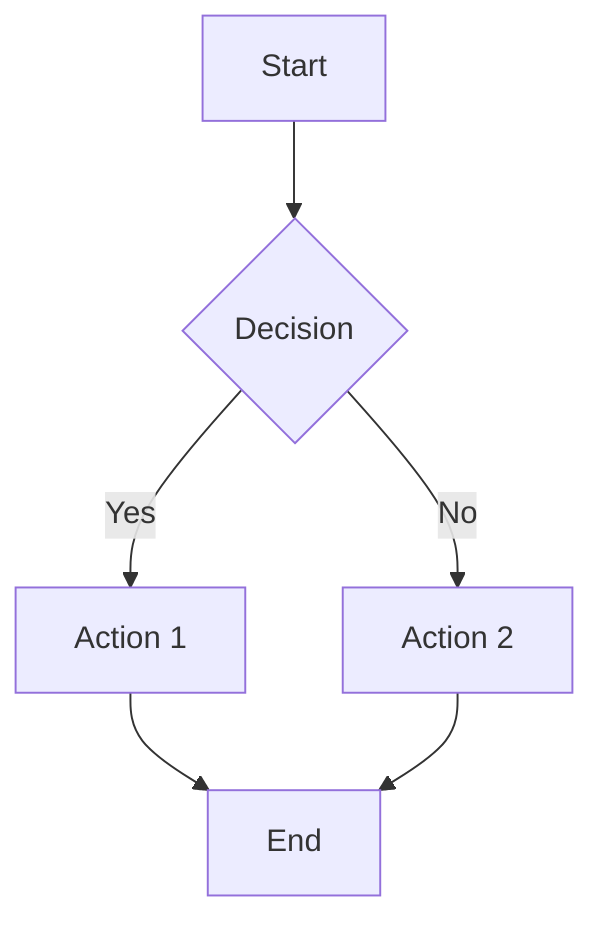

# MDVault

**Beautiful markdown viewer for GitHub Pages**

Transform your markdown files into a stunning documentation site with zero configuration. MDVault features a modern claymorphism design, dark mode, syntax highlighting, math equations, and more.

## Features

- 📝 **GitHub Flavored Markdown** - Full GFM support
- 🎨 **Claymorphism Design** - Modern, tactile UI with soft shadows
- 🌓 **Dark Mode** - Comfortable reading in any lighting
- 💻 **Syntax Highlighting** - Beautiful code highlighting for 100+ languages
- 🔢 **Math Equations** - LaTeX rendering with KaTeX
- 📊 **Mermaid Diagrams** - Flowcharts, sequence diagrams, ER diagrams, and more
- 📱 **Fully Responsive** - Perfect on any device
- ♿ **Accessible** - WCAG 2.1 AA compliant
- 🚀 **Zero Configuration** - Just add markdown files
- 🔗 **Clean URLs** - No `.md` extensions
- 📚 **Auto Navigation** - TOC, breadcrumbs, and page titles

## Quick Start

### 1. Clone or Use as Template

```bash
git clone https://github.com/yourusername/mdvault.git
cd mdvault
npm install
```

### 2. Add Your Content

Create markdown files in `public/content/`:

```
public/content/
├── index.md          # Your homepage
├── about.md          # About page
└── docs/
    └── guide.md      # Documentation
```

### 3. Develop Locally

```bash
npm run dev
```

Visit `http://localhost:4321` to see your site.

### 4. Deploy to GitHub Pages

```bash
npm run build
git add .
git commit -m "Initial commit"
git push origin main
```

Enable GitHub Pages in your repository settings (Settings → Pages → Source: GitHub Actions).

## Usage

### Writing Content

Every markdown file in `public/content/` becomes a page:

- `public/content/index.md` → `/`
- `public/content/blog/my-post.md` → `/blog/my-post`
- `public/content/docs/api/intro.md` → `/docs/api/intro`

### Markdown Features

#### Headings and Navigation

The first `# H1` becomes your page title. All `## H2` through `###### H6` headings appear in the table of contents.

```markdown
# My Page Title

## Section 1
Content here...

## Section 2
More content...
```

#### Code Blocks

Use fenced code blocks with language identifiers:

\`\`\`\`markdown
\`\`\`javascript
function hello() {
  console.log('Hello, MDVault!');
}
\`\`\`
\`\`\`\`

#### Math Equations

Inline math: \`$E = mc^2$\`

Block math:

```markdown
$$
\int_{-\infty}^{\infty} e^{-x^2} dx = \sqrt{\pi}
$$
```

#### Mermaid Diagrams

Create flowcharts, sequence diagrams, ER diagrams, and more:

```markdown

```

#### Tables

```markdown
| Header 1 | Header 2 |
|----------|----------|
| Cell 1   | Cell 2   |
```

## Configuration

### Base Path

For project pages (e.g., `username.github.io/mdvault`), update `astro.config.mjs`:

```javascript
export default defineConfig({
  site: 'https://username.github.io',
  base: '/mdvault',  // Your repository name
  // ...
});
```

For user pages (e.g., `username.github.io`), use:

```javascript
export default defineConfig({
  site: 'https://username.github.io',
  base: '/',
  // ...
});
```

### Customizing Themes

Edit color variables in `src/styles/global.css`:

```css
:root[data-theme='light'] {
  --clay-bg: #f0f0f3;
  --accent-primary: #3498db;
  /* ... */
}
```

## Project Structure

```
mdvault/
├── .github/
│   └── workflows/
│       └── deploy.yml          # GitHub Actions deployment
├── public/
│   └── content/                # Your markdown files go here
│       ├── index.md
│       ├── blog/
│       └── docs/
├── src/
│   ├── components/             # Astro components
│   ├── layouts/                # Page layouts
│   ├── lib/                    # Utilities (markdown, TOC, etc.)
│   ├── pages/                  # Astro pages
│   └── styles/                 # CSS files
├── astro.config.mjs            # Astro configuration
├── package.json
├── tailwind.config.mjs         # Tailwind configuration
└── tsconfig.json
```

## Scripts

- `npm run dev` - Start development server
- `npm run build` - Build for production
- `npm run preview` - Preview production build locally

## Tech Stack

- **Astro** - Static site generator
- **Vite** - Build tool
- **Tailwind CSS 4** - Styling framework
- **markdown-it** - Markdown parser
- **KaTeX** - Math rendering
- **Highlight.js** - Code syntax highlighting
- **Mermaid** - Diagram rendering

## Browser Support

MDVault supports all modern browsers:

- Chrome/Edge (latest 2 versions)
- Firefox (latest 2 versions)
- Safari (latest 2 versions)

## Contributing

Contributions are welcome! Please feel free to submit a Pull Request.

## License

MIT License - feel free to use this for your own projects!

## Support

- **Issues**: [GitHub Issues](https://github.com/yourusername/mdvault/issues)
- **Discussions**: [GitHub Discussions](https://github.com/yourusername/mdvault/discussions)

---

**Powered by MDVault** - Beautiful markdown, zero configuration.
