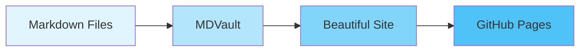

# Welcome to MDVault

A beautiful, zero-configuration markdown viewer for GitHub Pages with a stunning claymorphism design.

## Features

MDVault provides everything you need to transform your markdown files into a professional documentation site:

### Rich Markdown Support

- **GitHub Flavored Markdown** - Full GFM support including tables, strikethrough, and autolinks
- **Syntax Highlighting** - Beautiful code highlighting for 100+ languages
- **Math Equations** - Render LaTeX equations with KaTeX
- **Mermaid Diagrams** - Create flowcharts, sequence diagrams, ER diagrams, and more
- **Clean URLs** - No `.md` extensions in your URLs

### Beautiful Design

- **Claymorphism UI** - Modern, tactile design with soft shadows and rounded corners
- **Dark Mode** - Comfortable reading in any lighting condition
- **Responsive** - Perfect on mobile, tablet, and desktop
- **Accessible** - WCAG 2.1 AA compliant

### Auto-generated Navigation

- **Table of Contents** - Automatically generated from your headings
- **Breadcrumbs** - Always know where you are
- **Page Titles** - Extracted from your H1 headings

## Quick Start

1. Add markdown files to `public/content/`
2. Build with `npm run build`
3. Deploy to GitHub Pages

That's it! No configuration needed.

## Example Code

Here's some JavaScript with syntax highlighting:

```javascript
function greet(name) {
  console.log(`Hello, ${name}!`);
}

greet('MDVault');
```

## Example Math

Inline equation: $E = mc^2$

Block equation:

$$
\int_{-\infty}^{\infty} e^{-x^2} dx = \sqrt{\pi}
$$

## Example Mermaid Diagram



## Example Table

| Feature | Status |
|---------|--------|
| Markdown Rendering | ✅ |
| Syntax Highlighting | ✅ |
| Math Equations | ✅ |
| Mermaid Diagrams | ✅ |
| Dark Mode | ✅ |
| Responsive Design | ✅ |

## Get Started

Check out the [getting started guide](/docs/getting-started) to learn more about using MDVault for your documentation needs.
