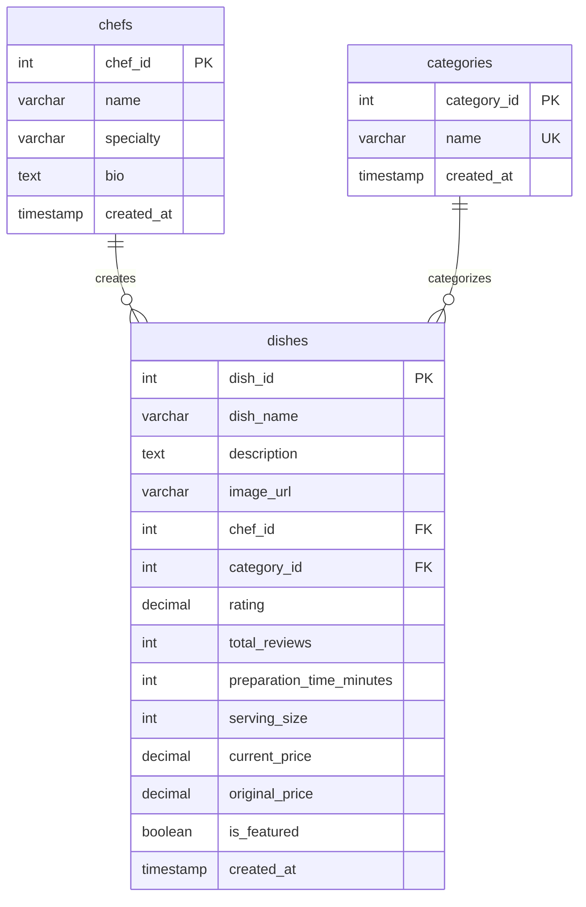

# PTUDW - Backend Examination: Food Delivery WebApp

## Quy tắc nộp bài

- Tên file: **&lt;MSSV&gt;-food-delivery-backend.zip** (có thể dùng định dạng file nén khác)
- Không nộp `node_modules`
- Thời gian làm bài: **120 phút**
- Thời điểm đóng link nộp bài: **10 phút** sau khi kết thúc thời gian làm bài

## Quy tắc nộp video ghi màn hình quá trình làm bài

- Sinh viên quay phim toàn bộ màn hình máy tính của mình trong suốt quá trình làm bài thi, bao gồm cả taskbar, system tray, đồng hồ hệ thống, camera cá nhân quay trọn vẹn khuôn mặt và **KHÔNG CHE** đồng hồ hệ thống.
- Sinh viên dùng **OBS Studio** kết hợp với **DroidCam** để quay phim
  - Video output: 1920 x 1080, Video Bitrate 720Kbs, FPS 30
  - Upload lên YouTube
  - Nộp link vào **cuối ngày thi**
- Sinh viên dùng **Loom** để quay phim
  - Nộp link vào **cuối ngày thi**

## Tài nguyên được cung cấp

Sinh viên được cung cấp các tài nguyên sau để thực hiện bài thi:

- `supabase/dishes_database.sql`
  - Database schema cho 3 tables: `dishes`, `chefs`, `categories`
  - Sample data: 27 món ăn, 7 đầu bếp, 7 chuyên mục
  - Verification queries để kiểm tra dữ liệu
  
- `html-files`: giao diện frontend tham khảo
  - `list.html` -> chức năng hiển thị danh sách món ăn với filters và phân trang
  - `create-dish.html` -> form tạo món ăn mới

### Database Schema



**Relationships:**
- Mỗi **chef** có thể tạo nhiều **dishes** (1-to-many)
- Mỗi **category** có thể chứa nhiều **dishes** (1-to-many)
- Mỗi **dish** thuộc về một **chef** và một **category** (many-to-1)
  
## Yêu cầu bài thi

### A - Backend API Development

Sinh viên xây dựng RESTful API backend với các endpoint sau:

#### **Endpoint 1: GET /dishes**

Trả về danh sách món ăn với hỗ trợ **phân trang** và **filter**.

**Query Parameters:**
- `category_id` (number, optional) - Lọc theo chuyên mục
- `chef_id` (number, optional) - Lọc theo đầu bếp  
- `page` (number, optional, default: 1) - Số trang hiện tại

**Yêu cầu:**
- JOIN với bảng `chefs` và `categories`, trả về dưới dạng **nested objects** (xem response bên dưới)
- Mỗi dish bao gồm:
  - 12 fields từ bảng **dishes**: `dish_id`, `dish_name`, `description`, `image_url`, `rating`, `total_reviews`, `preparation_time_minutes`, `serving_size`, `current_price`, `original_price`, `is_featured`, `created_at`
  - Object `chef`: `{ chef_id, name, specialty }`
  - Object `category`: `{ category_id, name }`
- **Filter logic:**
  - Khi có cả `category_id` VÀ `chef_id` → dùng logic **AND** để filter trên cả hai tiêu chí
  - Nếu chỉ có `category_id` → lọc theo category
  - Nếu chỉ có `chef_id` → lọc theo chef
- **Phân trang:**
  - **Cố định 9 món ăn mỗi trang**
  - `page=1` → offset = 0 (món 1-9)
  - `page=2` → offset = 9 (món 10-18)
  - `page=3` → offset = 18 (món 19-27)
  - Công thức: `offset = (page - 1) * 9`

<div class="page-break"></div>

**Response Format:**

```json
{
  "data": [
    {
      "dish_id": 1,
      "dish_name": "Phở Bò Đặc Biệt",
      "description": "Traditional Vietnamese beef noodle soup with premium beef cuts, rice noodles, and aromatic herbs in rich bone broth",
      "image_url": "https://images.unsplash.com/photo-1603133872878-684f208fb84b?w=400&h=300&fit=crop",
      "chef": {
        "chef_id": 1,
        "name": "Chef Nguyen Minh",
        "specialty": "Vietnamese Traditional Cuisine"
      },
      "category": {
        "category_id": 1,
        "name": "Vietnamese"
      },
      "rating": 4.8,
      "total_reviews": 1243,
      "preparation_time_minutes": 45,
      "serving_size": 1,
      "current_price": 75000,
      "original_price": 95000,
      "is_featured": true,
      "created_at": "2025-01-15T10:30:00Z"
    }
  ],
  "metadata": {
    "current_page": 1,
    "total_pages": 3,
    "total_dishes": 27,
    "can_navigate_next": true,
    "can_navigate_prev": false,
    "from_offset": 0,
    "to_offset": 8
  }
}
```

**Lưu ý về Metadata:**
- `current_page`: Trang hiện tại (từ query param `page`)
- `total_dishes`: Tổng số món ăn (có thể bị ảnh hưởng bởi filter)
- `total_pages`: Tổng số trang  (có thể bị ảnh hưởng bởi filter)
- `can_navigate_next`: `true` nếu `current_page < total_pages`
- `can_navigate_prev`: `true` nếu `current_page > 1`
- `from_offset`: Vị trí bắt đầu
- `to_offset`: Vị trí kết thúc

<div class="page-break"></div>

**Ví dụ request:**

```http
# Lọc theo cả category VÀ chef (AND logic)
GET /dishes?category_id=1&chef_id=1&page=1
→ Trả về: Chỉ những món Vietnamese (category_id=1) VÀ do Chef Nguyen Minh (chef_id=1) nấu
→ 9 món/trang

# Chỉ lọc theo category
GET /dishes?category_id=5&page=1
→ Trả về: Tất cả món Japanese (category_id=5), bất kỳ chef nào
→ 9 món/trang

# Chỉ lọc theo chef
GET /dishes?chef_id=2&page=1
→ Trả về: Tất cả món của Chef Kenji Tanaka (chef_id=2), bất kỳ category nào
→ 9 món/trang

# Không filter, chỉ phân trang
GET /dishes?page=1
→ Trả về: 9 món đầu tiên (trang 1, offset 0-8)

# Trang 2
GET /dishes?page=2
→ Trả về: Món từ 10-18 (trang 2, offset 9-17)

# Không có query params (dùng default)
GET /dishes
→ Trả về: 9 món đầu tiên (page=1 mặc định)
→ Với 27 món: total_pages=3, can_navigate_next=true
```

---

#### **Endpoint 2: GET /chefs**

Trả về danh sách tất cả đầu bếp (dùng cho dropdown list).

**Response Format:**

```json
{
  "data": [
    {
      "chef_id": 1,
      "name": "Chef Nguyen Minh",
      "specialty": "Vietnamese Traditional Cuisine"
    },
    {
      "chef_id": 2,
      "name": "Chef Kenji Tanaka",
      "specialty": "Japanese Fusion"
    }
  ]
}
```

---

#### **Endpoint 3: GET /categories**

Trả về danh sách tất cả chuyên mục (dùng cho dropdown list).

**Response Format:**

```json
{
  "data": [
    {
      "category_id": 1,
      "name": "Vietnamese"
    },
    {
      "category_id": 2,
      "name": "Asian Fusion"
    }
  ]
}
```

---

#### **Endpoint 4: POST /dishes**

Tạo món ăn mới với đầy đủ validation.

**Request Body:**

```json
{
  "dish_name": "Bánh Xèo Miền Tây",
  "description": "Crispy Vietnamese pancake filled with shrimp, pork, and bean sprouts served with fresh herbs and fish sauce",
  "image_url": "https://images.unsplash.com/photo-1559314809-0d155014e29e?w=400&h=300&fit=crop",
  "chef_id": 1,
  "category_id": 1,
  "rating": 4.5,
  "total_reviews": 0,
  "preparation_time_minutes": 30,
  "serving_size": 2,
  "current_price": 55000,
  "original_price": 75000,
  "is_featured": false
}
```

<div class="page-break"></div>

**Validation Requirements:**

| Field | Yêu cầu |
|-------|---------|
| `dish_name` | Required, string, tối đa 500 ký tự |
| `description` | Required, string, **tối thiểu 50 ký tự** |
| `image_url` | Required, định dạng URL hợp lệ, tối đa 1000 ký tự |
| `chef_id` | Required, integer, **phải tồn tại trong bảng chefs** |
| `category_id` | Required, integer, **phải tồn tại trong bảng categories** |
| `rating` | Required, number, **từ 0.0 đến 5.0** |
| `total_reviews` | Optional, integer, default **0**, **>= 0** |
| `preparation_time_minutes` | Required, integer, **>= 1** |
| `serving_size` | Optional, integer, default **1**, **>= 1** |
| `current_price` | Required, decimal, **>= 0** |
| `original_price` | Required, decimal, **>= current_price** |
| `is_featured` | Optional, boolean, default **FALSE** |

**Success Response (201 Created):**

```json
{
  "data": {
    "dish_id": 28,
    "dish_name": "Bánh Xèo Miền Tây",
    "description": "Crispy Vietnamese pancake filled with shrimp, pork, and bean sprouts served with fresh herbs and fish sauce",
    "image_url": "https://images.unsplash.com/photo-1559314809-0d155014e29e?w=400&h=300&fit=crop",
    "chef_id": 1,
    "category_id": 1,
    "rating": 4.5,
    "total_reviews": 0,
    "preparation_time_minutes": 30,
    "serving_size": 2,
    "current_price": 55000,
    "original_price": 75000,
    "is_featured": false,
    "created_at": "2025-12-20T10:30:00Z"
  }
}
```

<div class="page-break"></div>

**Error Response (400 Bad Request):**

```json
{
  "error": {
    "message": "Validation failed",
    "details": [
      "description must be at least 50 characters",
      "chef_id does not exist in database",
      "original_price must be greater than or equal to current_price"
    ]
  }
}
```

---

### B - Yêu cầu kỹ thuật

#### Authentication
- Cài đặt cơ chế **simple anonymous key authentication**
  - Kiểm tra header `apikey` trong request
  - Từ chối request nếu không có hoặc sai `apikey`

#### CORS
- Cấu hình CORS cho phép frontend truy cập

#### Error Handling
- Sử dụng đúng **HTTP status codes**:
  - `200 OK` - GET thành công
  - `201 Created` - POST thành công
  - `400 Bad Request` - Validation error
  - `500 Internal Server Error` - Lỗi server
- Error response theo format: `{ error: { message, details } }`

#### Input Validation & Security
- Validate tất cả input từ client
- **Sanitize input** để tránh SQL injection
  - Sử dụng **parameterized queries** (prepared statements)
  - Hoặc sử dụng **ORM** (Prisma, TypeORM, Drizzle, Knex)
  - **KHÔNG** nối chuỗi trực tiếp vào SQL query

**Ví dụ sanitize input:**

**KHÔNG an toàn** (SQL Injection vulnerability):
```javascript
const category_id = req.query.category_id;
const query = `SELECT * FROM dishes WHERE category_id = ${category_id}`;
db.query(query); // NGUY HIỂM!
```

<div class="page-break"></div>

**An toàn** (Parameterized Query):
```javascript
const category_id = req.query.category_id;
const query = 'SELECT * FROM dishes WHERE category_id = $1';
db.query(query, [category_id]); // AN TOÀN
```

**An toàn** (Sử dụng ORM):
```javascript
const dishes = await prisma.dishes.findMany({
  where: { category_id: parseInt(category_id) }
});
```

**An toàn** (Sử dụng Supabase Client):
```javascript
const { data } = await supabase
  .from('dishes')
  .select('*')
  .eq('category_id', category_id);
```

---

### C - Công cụ khuyên dùng

**Backend Framework:**
- **Node.js**: Express.js, Fastify, NestJS
- **Python**: FastAPI, Flask, Django
- ...

**Database Client:**
- **Supabase JS Client**
- **PostgreSQL**: pg
- **ORM**: Prisma, Drizzle, TypeORM, knex

**Testing Tools:**
- **Postman**
- **Thunder Client** (VS Code extension)
- **REST Client** (.http files)

**Environment:**
- Sử dụng **.env** file cho cấu hình
  - Database connection string
  - Supabase URL & Anon Key
  - Port number

---

## Thang điểm và quy định

### **Project Setup & Configuration (1 điểm)**

| Tiêu chí | Điểm |
|----------|------|
| Implement simple anonymous key authentication | 0.5 |
| Cấu hình environment variables (.env file) đầy đủ | 0.25 |
| Cấu hình CORS cho phép frontend truy cập | 0.25 |

---

### **GET /chefs, /categories (1 điểm)**

| Tiêu chí | Điểm |
|----------|------|
| GET /chefs trả về tất cả chefs với cấu trúc `{ data: [...] }` | 0.5 |
| GET /categories trả về tất cả categories với cấu trúc `{ data: [...] }` | 0.5 |

---

### **GET /dishes - Filtering & Pagination (5 điểm)**

| Tiêu chí | Điểm |
|----------|------|
| Endpoint trả về dishes thành công với cấu trúc `{ data, metadata }` đúng | 1.5 |
| Filter theo category_id hoạt động đúng | 0.5 |
| Filter theo chef_id hoạt động đúng | 0.5 |
| Filter theo cả category_id VÀ chef_id hoạt động đúng | 0.5 |
| Pagination hoạt động chính xác với query `page` (limit cố định = 9) | 1.25 |
| Metadata chứa đầy đủ 7 fields: `current_page`, `total_pages`, `total_dishes`, `can_navigate_next`, `can_navigate_prev`, `from_offset`, `to_offset` | 0.75 |

---

### **POST /dishes - Create with Validation (3 điểm)**

| Tiêu chí | Điểm |
|----------|------|
| Validate đầy đủ các required fields cơ bản (dish_name, description, image_url, chef_id, category_id) | 0.25 |
| Validate các numeric fields (rating, total_reviews, preparation_time_minutes, serving_size, prices) | 0.25 |
| Business logic validation (rating 0-5, original_price >= current_price) | 0.5 |
| Foreign key validation (chef_id, category_id phải tồn tại trong database) | 0.5 |
| Error handling với validation messages chi tiết theo format `{ error: { message, details: [...] } }` | 0.25 |
| Insert vào database thành công | 0.75 |
| Trả về created dish với `dish_id` mới theo cấu trúc `{ data: {...} }` | 0.5 |

---

**Chúc các bạn làm bài tốt!**
